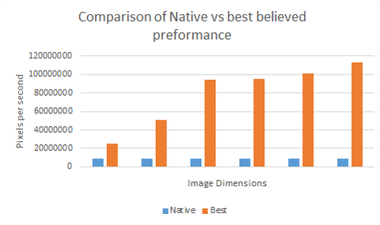
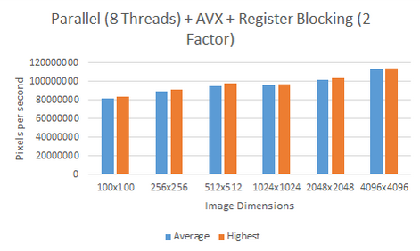
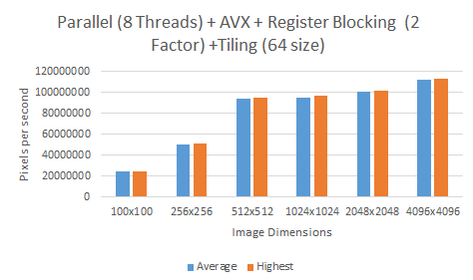
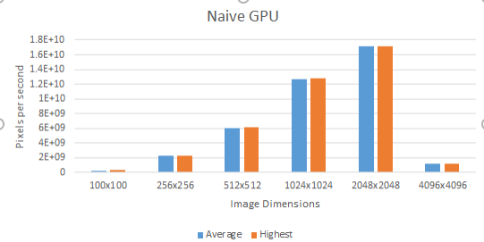
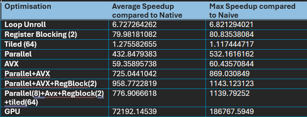

# Optimisation-of-code-for-specified-harware

This is a High preformance computing project that that tries to observe the benefits of writing code that will optimise the program for predetermined CPU and GPU hardware devices.

This project aims to optimise a Sobel routine using compiler optimisations for a CPU and create a naive GPU implmenation for comparison.
The final goal of this project will deliver a routine that achieves the best possible speedup found experimentally and theoretically.

## Optimisations used

 - Loop unroll
 - Register Blocking
 - Loop tiling
 - Parallelism
 - AVX
 - Strength Reduction
 - Scalar displacement

## System information

OS: Windows 11 x64 based
32 GB DDR5 at 5600 Mt/s

### CPU
AMD Ryzen 7 7700X

[Full specifications]:  ​https://www.amd.com/en/products/processors/desktops/ryzen/7000-series/amd-ryzen-​​7-7700x.html​

- Core No. : 8
- Threads No. : 16

 - Base clock speed of one core: 4.5 GHz
 - Boost clock of of one core: 5.4 GHz

- Cache line of 64 bytes

 - L1 Cache
   -- 512 KB Total
   -- 64 Kb per core
 - L2 Cache
   -- 8 MB Total
   -- 1 MB per core
 - L3 Cache
   -- 32 MB Shared

Supported extensions: AES , AMD-V , AVX , AVX2 , AVX512 , FMA3 , MMX-plus , SHA , SSE , SSE2 , SSE3 , SSE4.1 , SSE4.2 , SSE4A , SSSE3 , x86-64

### GPU
Nvidia Geforce 4080 Founders Edition

[Full specifications]: https://www.nvidia.com/en-us/geforce/graphics-cards/40-series/rtx-4080-family/  

- Vram: 16 GB  

- Tensor cores: 304 

- Clock speed: 2205 MHz 

- Boost clock: 2505 MHz 

- Bandwidth: 716.8 Gb/s

## Results

### Speedup table
Show of percent gange in pixels per second

